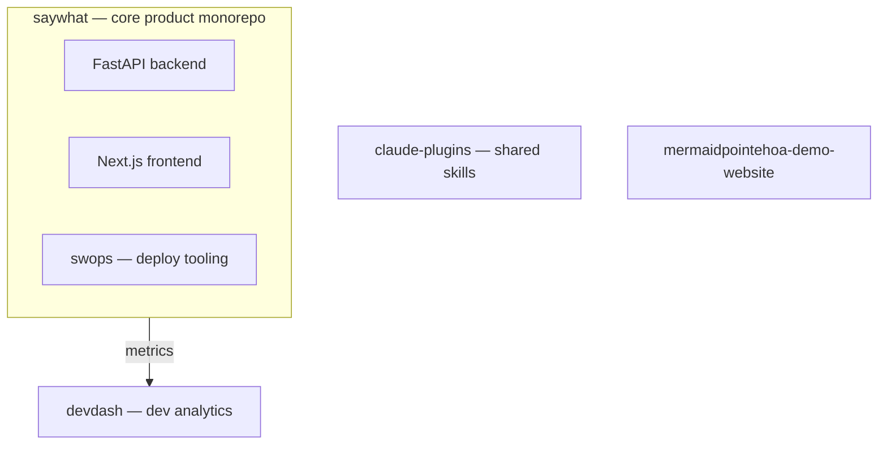
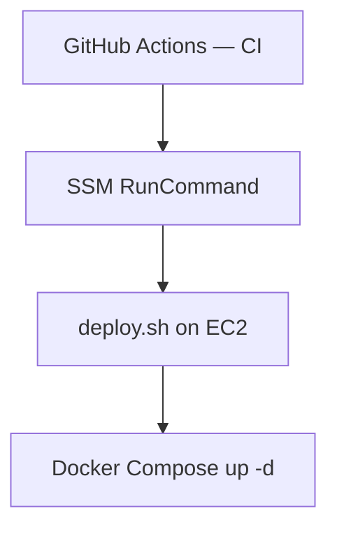

# SayWhatTech — Organization Architecture

## How Repos Relate

- **saywhat** is the core product. It contains the FastAPI backend, Next.js frontend, and Caddy reverse proxy — all deployed together via Docker Compose.
- **swops** (inside `saywhat`) manages deployment operations — build scripts, deploy orchestration, and environment configuration.
- **devdash** tracks development metrics for saywhat and other repos, pulling data from GitHub project analytics.
- **claude-plugins** provides the shared Claude Code skill marketplace used across all repos.
- **mermaidpointehoa-demo-website** is a standalone static demo site, not connected to the main infrastructure.

---

## AWS Infrastructure

### Compute

- **One EC2 instance per environment per app** (e.g., `saywhat-prod`, `devdash-prod`)
- Applications run as Docker containers managed by Docker Compose

### Infrastructure as Code

- Terraform configs live in each repo under `infra/terraform/`
- State is stored in S3 with a shared bucket pattern: `<app>-terraform-state`
- Example: `saywhat-terraform-state`, `devdash-terraform-state`

### Secrets Management

- Secrets are stored in **AWS SSM Parameter Store**
- Path convention: `/<app>/<env>/` (e.g., `/saywhat/prod/`, `/devdash/prod/`)
- Access secrets in code via SSM SDK calls or inject at deploy time

---

## Deployment Pipeline

1. **GitHub Actions** runs CI checks (lint, test, build) on PR
2. On merge to `main`, the deploy workflow triggers **SSM RunCommand** targeting the appropriate EC2 instance
3. The instance runs `deploy.sh`, which pulls the latest images and runs `docker compose up -d`

---

## Databases

| App | Database | Provider | Connection |
|-----|----------|----------|------------|
| saywhat | PostgreSQL | Neon (managed) | Connection string in SSM at `/saywhat/<env>/DATABASE_URL` |
| devdash | PostgreSQL | PostgreSQL via SSM | Connection string in SSM at `/devdash/<env>/DATABASE_URL` |

---

## Versioning

- **Semver** per component (e.g., saywhat API and Web are versioned independently)
- **Automatic patch bumps** via `version-bump.yml` GitHub Actions workflow
- Version tracked in each component's package config (`pyproject.toml`, `package.json`)

---

*Last updated: 2026-04-03*
